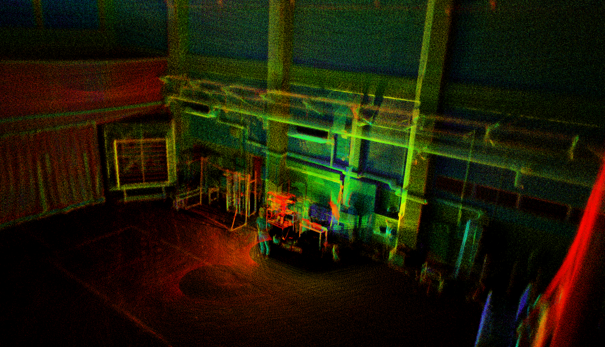
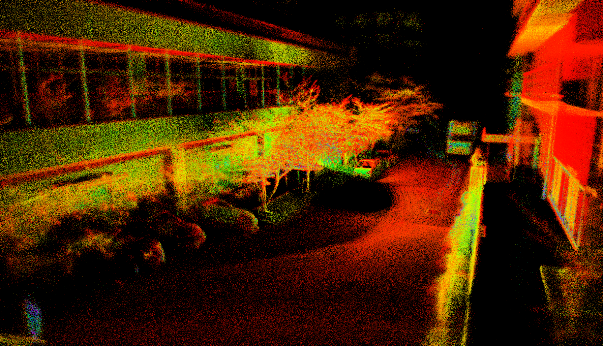

# ctlio_ros2

**ctlio_ros2** is a ROS2 package for Continuous-Time LiDAR–Inertial Odometry based on a cumulative B-spline on the *SO*(3) Lie group.

The entire optimization pipeline is implemented from scratch, with all Jacobians explicitly derived and implemented analytically by the author. The detailed derivations can be found in **doc/ctlio_jacobians.pdf** (currently available in Japanese only).

<p align="center">    </p>

---

## How to Use

**ctlio_ros2** depends on *Sophus* (and *Eigen*), *nanoflann*, and *yaml-cpp*. Please install these dependencies before building **ctlio_ros2**.

```bash
cd your/ros2/ws/src
git clone https://github.com/NaokiAkai/ctlio_ros2.git
cd ..
colcon build
source install/setup.bash
ros2 launch ctlio_ros2 ctlio_node.launch.py
```

Configuration files are located in the **config** directory.

**ctlio_ros2** has been tested only with Livox MID-360 PointCloud2 messages. 

The default required topics are "/livox/lidar" (*sensor_msgs::msg::PointCloud2*) and "/livox/imu" (*sensor_msgs::msg::Imu*).


## License

This software is provided under a custom non-commercial license. 

**Non-commercial use only.**  Commercial use, including use in products or business environments, is strictly prohibited without prior written permission.

See the [LICENSE](LICENSE) file for full details.

For commercial licensing inquiries, please contact the author:
Naoki Akai (n.akai.goo[at]gmail.com)
